# Лекции по компьютерным технологиям

## Выполнено студентами ТД-Б14

+ Березуцкая Мария
+ Пыжов Даниил
+ Трофименко Елисей

## Cодержание

+ Markdown
+ Bazaar
+ Cygwin
+ Freemind
+ Ggobi
+ Github
+ Gnuplot
+ JabRef
+ Maxima
+ Pandoc
+SciDaVis

# Markdown

**Markdown** — облегчённый язык разметки, созданный с целью написания максимально читаемого и удобного для правки текста, но пригодного для преобразования в языки для продвинутых публикаций (*HTML*, *Rich Text* и др.).

Первоначально создан в 2004 году Джоном Грубером и Аароном Шварцем. Многие идеи языка были позаимствованы из существующих соглашений по разметке текста в электронных письмах. Реализации языка Markdown преобразуют текст в формате Markdown в валидный, правильно построенный XHTML и заменяют левые угловые скобки («<») и амперсанды («&») на соответствующие коды сущностей. Первой реализацией Markdown стала написанная Грубером реализация на Perl, однако спустя некоторое время появилось множество реализаций от сторонних разработчиков. Реализация на Perl распространяется по лицензии типа BSD. Реализации Markdown на различных языках программирования включены (или доступны в качестве плагина) во многие системы управления содержимым.

### Примеры синтаксиса

+ Текст с выделением или логическим ударением:

		*выделение* (например, курсив)
 		**сильное выделение** (например, полужирное начертание)

+ Программный код:

		`сам_код($аргумент)`


+ Списки:

		 * элемент маркированного списка
 		- ещё один элемент ненумерованного списка
 		+ буллеты элементов могут быть разными

+ Пронумерованные списки:

		 1. Элемент нумерованного списка
		 2. Элемент №2 того же списка
 		9. Элемент №3 списка — элементы нумеруются по порядку, 
		цифра в начале строки не имеет значения

+ Заголовки:

Создание заголовков производится путём помещения знака решетки перед текстом заголовка. Количество знаков «#» соответствует уровню заголовка. HTML предоставляет 6 уровней заголовков.

		# Заголовок первого уровня
		### Заголовок четвёртого уровня


+ Цитаты (тег blockquote):
+ Ссылки:

		[Текст ссылки](адрес://ссылки.здесь "Заголовок ссылки")
или

		[Текст ссылки][тег]

+Изображения:

				
		


# Bazaar 

**Bazaar** - распределённая система управления версиями. Система Bazaar разработана с целью облегчить работу над развитием свободных и открытых проектов для всех желающих.

 Система контроля версий **Bazaar** написана на языке программирования Python. Существуют установочные пакеты для основных дистрибутивов Linux, инсталляторы для Mac OS X и MS Windows. Bazaar — это свободное программное обеспечение, в настоящее время является частью проекта GNU

Команды **Bazaar** очень похожи на команды, используемые в CVS или SVN. Для создания и поддержки нового проекта без использования специального сервера с репозиторием пользователю достаточно запустить команду bzr init в том каталоге, который нужно поместить под контроль версий.

**Bazaar** поддерживает работу напрямую с некоторыми другими системами контроля версий. Пользователи могут создавать новые ветки на основе репозиториев других систем (таких как Subversion или Git), делать локальные изменения и фиксировать их в Bazaar-ветке, и затем отправлять свои изменения назад в оригинальный репозиторий.

 **Bazaar** поддерживает полный набор символов Unicode в именах файлов. Система также позволяет использовать Unicode для составления комментариев к ревизиям, в именах авторов изменений и т. д.

**Bazaar** устанавливает единственную новую команду, **bzr**. Все возможности предоставляются через под-команды этой команды.


# Cygwin

Cygwin (произносится /ˈsɪgwɪn/)[2] — UNIX-подобная среда и интерфейс командной
строки для Microsoft Windows. Cygwin обеспечивает тесную интеграцию приложений,
данных и ресурсов Windows с приложениями, данными и ресурсами UNIX-подобной 
среды. Из среды Cygwin можно запускать обычные приложения Windows, также можно 
использовать инструменты Cygwin из Windows.

Это свободное ПО, опубликованное под GNU General Public License версии 2.

Поддерживает языки C, C++, Objective-C, Fortran, Gambas, Perl, Python, Ruby и другие.


### Работа с каталогами:

**Pwd** - Путь рабочего (текущего) каталога

**Ls** - Список - список файлов в текущем каталоге

**Cd <путь каталога>** - переход в указанный каталог

**Ls-l**  - Список файлов и их атрибутов

**Cp -R <каталог> <новый каталог>**  - Создать копию каталога

### Работа с файлами:

**Cp <filename> <new filename>** - Создать копию файла

*Mv <filename> <new filename>** - перемещение или переименование файла

**Rm <filename>** - удалить файл

**sed -<command> <filename>** - не загружая указанный файл, исполняет над ним
указанную команду.

**grep** - поиск в файлах вхождений чего-либо: возвращает номера строк, в которых
содержится аргумент.

## Пример построения графика

Мы имеем файл с огромным объёмом данных - 30 млн показаний тока и напряжения.
Оперативной памяти с использованием классических пользовательских программ может
не хватить. Cygwin позволяет обращаться к файлам, не открывая их - именно за счёт
этого мы можем относительно легко построить график.

Файл big.txt:

Обрезаем первые 19 строк (символьные), создаём remnants.txt, 
где будут только численные данные:

```
sed -e '1,19d'<big.txt>remnants.txt
```

С помощью gnuplot строим график по показаниям remnants.txt

```
gnuplot -e 'set terminal png; set out "see.png" plot "remnants.txt" u 1:2'
```
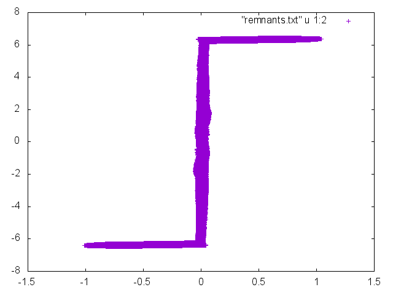

# FreeMind

**FreeMind** — свободная бесплатная программа для создания диаграмм связей (правильное название понятия, чаще известного как «карты памяти», «mind maps»). FreeMind написана на Java и распространяется согласно GNU General Public License. Программа обладает расширенными возможностями экспортирования. Экспорт XHTML позволяет создать карту-схему с разветвленной структурой и ссылками на внешние источники.

Использовать программы такого класса можно для любых целей - это легкий способ организовать части какого-либо объекта в единое целое. За примерами далеко ходить не надо. К примеру, самое простое и "приземленное" - список покупок для похода в магазин. Также это может быть план выступления перед аудиторией; презентационный инструмент для отображения основных положений чего-либо... и многое другое. Возможности карт ума практически безграничны.

Здесь показан пример работы в программе FreeMind:


**Знакомство с FreeMind**

После запуска, в главном окне программы доступны следующие возможности:

+ **Меню** — в нем есть как общераспространенные пункты File, Edit, View, так и присущие только данной программе (большинство этих пунктов доступны также через сочетания клавиш);
+ **Горизонтальная панель инструментов** — на ней есть часто используемые команды приложения, такие как кнопка или выпадающее меню;
+ **Вкладки** — возможность одновременно работать с несколькими открытыми картами, легко переключаясь между ними;
+ **Основное окно** — рабочее пространство.
+ **Вертикальная панель инструментов** — если нужно добавить иконки для узлов карты
+ **Окно правки** (в самом низу) — здесь можно добавить текст (в формате html) на создаваемой карте для выбранного узла.

**Экспорт готовых карт**

Когда карта готова и сохранена, ее можно экспортировать в любой формат:

+ в виде отдельной ветки в новую карту;
+ в формат файла html;
+ в файл html с поддержкой flash;
+ в файл xhtml (интерактивная карта);
+ в текстовый документ OpenOffice/LibreOffice
+ в графический файл формата jpg или png

**Конфигурирование FreeMind**

Путем изменения настроек, пользователь может настроить программу так, как ему нужно. Например, изменить способ автоматического сохранения, задать язык интерфейса, отредактировать рабочее окружение и поведение программы, создать необходимые сочетания клавиш и многое другое. Все настройки выполняются в меню Tools - Preferences. Таким образом, программа FreeMind может быть превращена в удобный инструмент для работы - персонально для каждого пользователя.

**Документация**

Подробная информация о программе FreeMind и возможностях по ее использованию доступна через меню Help. Помимо этого, в программе есть еще несколько способов получения справки:

+ при создании карт ума можно воспользоваться контекстной справкой, подсказывающей доступные варианты работы на данный момент
+ имеется краткое руководство пользователя по клавиатурным сочетаниям в формате pdf
+ в Интернете существует wiki-проект, посвященный программе FreeMind. На нем представлена полная информация о данном приложении: документация, справка, страницы часто задаваемых вопросов (FAQ). 


# GGobi

**GGobi** — это программа для наглядного представления многомерных данных.

Она может создавать как высокодинамичные и интерактивные графики, например экскурсии (вращение графика в более чем трех измерениях), так и привычные диаграммы рассеивания, гистограммы и построения с параллельными координатами. Графики являются интерактивными и могут быть связаны закраской и идентификацией.

**Возможности программы** 

+ Вывод графика в виде матрицы
+ Создание трехмерных и двухмерных графиков
+ Вращение графиков
+ Динамика отображения и выбор плоскости
+ Задавать цвет точек

Пример построения графика в GGobi из файла iris.csv:


# GitHub

На сегодняшний день **GitHub** – это один из самых популярных сервисов для совместной разработки программного обеспечения и его хостинга в облаке. Крупные IT-компании, такие как Microsoft, Google, Facebook и многие другие, используют данный ресурс для размещения исходных кодов своих разработок. 

**GitHub** – это сервис на основе Git. Является удобным и популярным инструментом управления версиями и включает систему отслеживания ошибок. Адрес в Интернете: *https://github.com/*

**Репозиторий** – это хранилище исходного кода нашего программного проекта. Публичный репозиторий виден абсолютно всем, а приватный только вашим разработчикам (тем, кому мы даем доступ).
Работа с репозиторием возможна, как и с помощью **веб-сайта**, так и с помощью **клиентов для компьютера** (консольного или с графическим интерфейсом), которых существует множество.

Программа **Git Bash** - это шелл, сделанный на основе Cygwin, поэтому возможно использование Unix-команд, вроде ls, cd, mkdir.

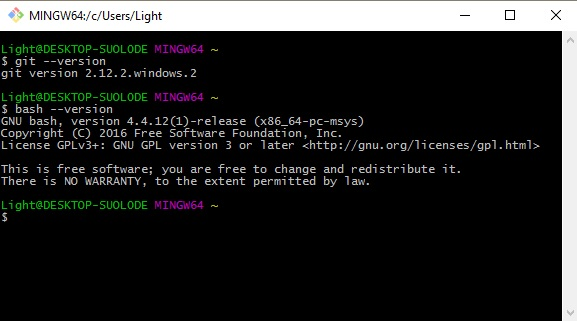

## Настройка Git

Перед началом работы нам необходимо немного настроить программу. Нам нужно установить имя пользователя и электронный адрес через командную строку:

		git config --global user.name "имя"
		git config --global user.email "емайл"


Также нам нужно настроить параметры установок окончания строк, для Windows вводим команды: 

		git config --global core.autocrlf true
		git config --global core.safecrlf false
		git config --global core eol native


## Создание проекта

1. Создаем репозиторий на сайте github.com
2. Инициализируем папку для Git репозитория (нужно делать 1 раз для каждого проекта)

		git init

3. Связываем папку с удаленным репозиторием:

			git remote add origin https://github.com/special4KT/LecturesKT
4. Добавляем все новые и измененные файлы:

		git add

5. Помечаем все новые и измененные файлы сообщением (**commit**)

		git commit -m "message"

6. Заливаем код на удаленный репозиторий

		git push -u origin master

Данная команда используется только один раз, последующее добавление кода осуществляется без флагов

		git push

7. Для скачивания репозитория используем команду:

		git pull
8. Чтобы посмотреть статус изменений, используем команду:

		git status

## Откат изменений

1. Полный откад до предыдущего коммита

		git reset HEAD --hard

2. Сброс изменений в файле на версию коммита

		git checkout <filename>

3. Откат до установленного тега, например v1

		git checkout v1


# Gnuplot

**Gnuplot** - это программа для построения двух- и трехмерных графиков. Она имеет собственную систему команд и может работать в режиме командной строки. 

Особенность этой программы в том, что она не обременена графическим интерфейсом.
##Окно программы 

/ 

##Построение графиков функций
Построим график синуса:

**gnuplot> plot sin(x)**

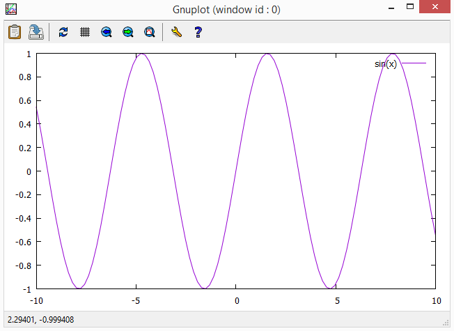/

Также мы можем построить сразу несколько графиков:

**gnuplot> plot sin(x),cos(x)**

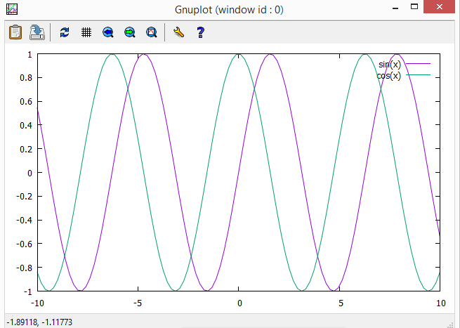/

В программе gnuplot можно строить и 3d графиков функций или даже 4-х мерный график функций.

**Скрипты** - набор команд в текстовом файле, которые мы будем часто использовать.

Чтобы построить много графиков, воспользуемся командой **multiplot**:

**gnuplot> set multiplot**

**multiplot> set size 1,0.5**

**multiplot> set origin 0.0,0.5; plot sin(x)**

**multiplot> set origin 0.0,0.0; plot cos(x)**

**multiplot> unset multiplot**

## Получение помощи

Используя команду **help**, мы можем воспользоваться помощью

**gnuplot> help**

## Построение графиков по данным

Строим график по данным, которые находятся в текстовом документе "data.txt"

**gnuplot> cd 'C:\Users\1\Desktop'**

**gnuplot> plot "data.txt" using 1:2**

У нас получаться точки. Чтобы построить линии, нужно записать так:

**gnuplot> plot "data.txt" using 1:2 with lines**

Также в этой программе с помощью специальных команд мы можем подписывать координатные оси и названия графиков.

**set title** - главное названия (название графика);

**set xlabel** - название оси х;

**set ylabel** - название оси у;

**set xr,yr** - координаты х и у.

## Лабораторная работа

Нужно построить графики в **gnuplot** по данным W, AP, КП.

1. Строим график мощности W.

Сначала из АПЛ возьмем значения мощности и перенесем их в текстовый документ с названием "w.txt". Затем в **gnuplot** пишем команду:

**gnuplot> plot "w.txt" using 1:2 with lines**

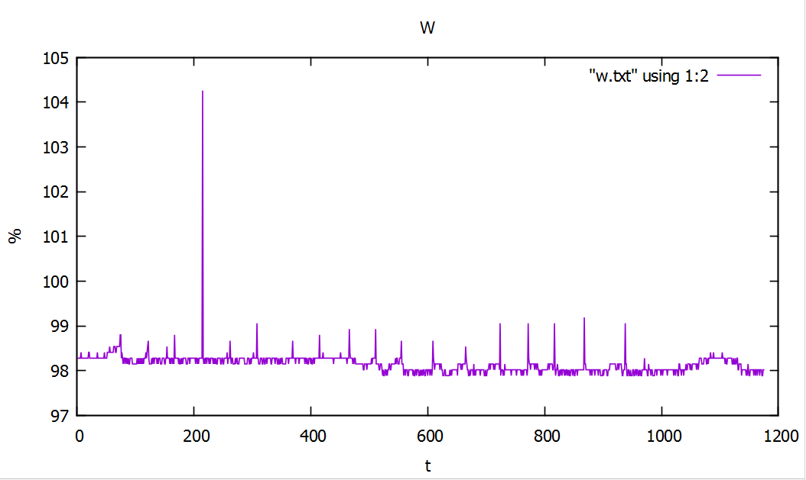/

2. Строим график данных двух АР.

Точно также сохраняем данные в текстовом документе и пишем в **gnuplot**:

**gnuplot> set multiplot**

**multiplot> set size 1,0.5**

**multiplot> set origin 0.0,0.5; plot "АР1.txt" using 1:2 with lines**

**multiplot> set origin 0.0,0.0; plot "АР2.txt" using 1:2 with lines**

**multiplot> unset multiplot**

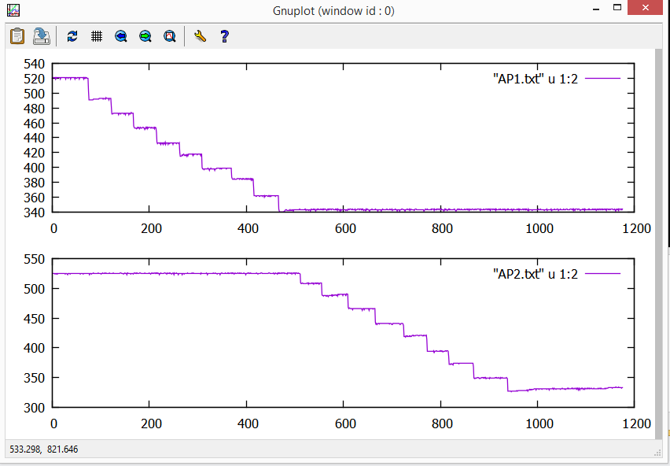/

# Jabref

Это система управления библиографической информацией. Она использует Bibtex как
базовый формат. При этом она представляет нам удобный пользовательский интерфейс
для записи и редактирования используемой нами литературы при создании различных
работ, статей, книг и т.д. в формате BibTeX. 

Запись в формате BibTeX позволяет записать полученный список литературы по всем правилам оформления.

## Возможности программы

- Полностью совместим с BibTeX

- Полнотекстовый поиск по всей библиографии.

- Импорт различных форматов: BibTeXML, CSA, Refer/Endnote, Web of Knowledge, SilverPlatter, Medline/Pubmed (xml), Scifinder, OVID, INSPEC, Biblioscape, Sixpack, JStor and RIS.

- Экспорт в разных форматах HTML, Docbook, BibTeXML, MODS, RTF, Refer/Endnote и OpenOffice.org.

- Группировка по любым полям BibTeX, ключевым словам.

- Интеграция с десктоп-окружением: запуск программ просмотра PDF/PS, браузера, вставка цитирований в LyX, Kile, LatexEDitor, Emacs, Vim и WinEdt, OpenOffice.org (с помощью плагина)

- Поддержка плагинов — расширений.

- Автоматическое создание BibTeX ключей

## Примеры использования

При написании курсовой работы, а также конспекта лекций мы формируем список используемой литературы в JabRef.

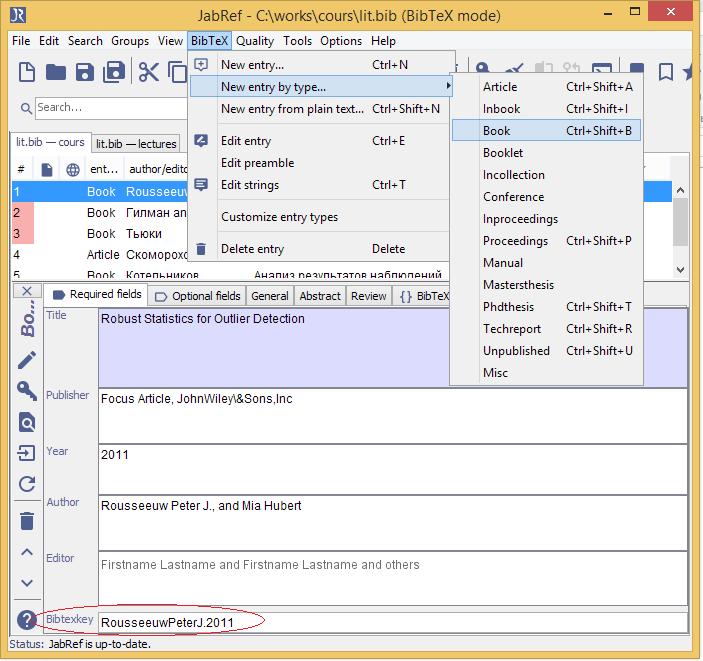

Внутри работы в нужных местах мы делаем ссылки на каждую книгу из списка, где внутри квадратных скобок
после значка @ стоит соответствующий bibtex key. 

Затем при переводе из md в pdf с помощью pandoc, используя специальный bat-файл, третьим аргументом мы указываем этот самый .bib-файл.

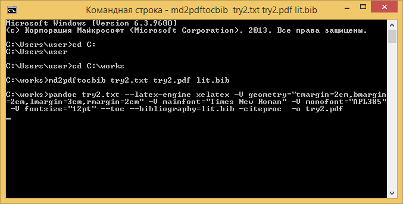

В результате, в конце pdf-файла присоединяется оформленный по всем правилам список литературы.


# Maxima

**Maxima** -программа для выполнения различных математических операций, также строит графики с помощью прораммы gnuplot. Ее базовый интерфейс - это командная строка. 

**wxMaxima** - пользовательский интерфейс основной программы maxima (имеются встроенные меню для выполнения стандартных математических операций).

## Символьные вычисления в Maxima

### Среда maxima и wxmaxima. Режим калькулятора

Набрать выражение, закончить строку ";" и SHIFT-ENTER для выполнения.

**(%i1)** - метка для первой строки ввода;

**(%o1)** - метка для первой строки вывода (результат вычислений).

Например: 
```
	(%i1)   2*2^-2;
	(%o1)   1/2

	(%i1)   1/2+1/4;
	(%o1)   3/4
```
**float(%);** - эта команда, выведет строку, которую мы укажем (float(%i1);).

Мы послали 5 строк (синие) на выполнение в Maxima. Каждая строка 
должна завершаться символом ";" или "$". Для ";", Maxima
выведет (покажет) результат выполнения строки. При использовании "$"
результат будет получен, но не выведен. (Полезно для скрытия промежуточных результатов громоздких вычислений).

**"1/3"** - вычисляется символьно (простая дробь);

**"1.0/3.0"** - вычисляется численно (десятичная дробь);

**%**    - использует последний результат вычислений;

**%o1**  - результат выведенный в строке с данным идентификатором.

Пример символьного вычисления с последующим переводом в численный результат:
```
	(%i10)   sqrt(2 * %pi);
             float(%);
	(%o9)    sqrt(2)*sqrt(%pi)
	(%o10)   2.506628274631001
```
### Присвоение. Алгебраические выражения

Присвоение (":") переменных:
```
(%pi - пример константы)

	(%i14)   radius: 10 $
         	 height: 100 $
         	 area: %pi * radius^2;
         	 volume: area * height;
	(area)   100*%pi
	(volume) 10000*%pi
```
Перевод результата в численную форму:
```
	(%i15)   float(%);
	(%o15)   31415.92653589793
```
Работа с алгебраическими выражениями:
```
	(%i16)   factor(y^2-x^2);
	(%o16)   (y-x)*(y+x)
	(%i17)   expand(%);
	(%o17)   y^2-x^2
	(%i18)   factor(x^2+2*x+1);
	(%o18)   (x+1)^2
	(%i19)   expand((x-1)^3);
	(%o19)   x^3-3*x^2+3*x-1
```
### Дифференцирование и интегрирование

Для дифференцирования используется функция "diff".
```
	(%i24)   f(x) := x^2 $
			 diff(f(x), x);
	         g(y) := sin(y)$
	         g(f(x));
	         diff( g(f(x)) , x);
	(%o21)   2*x
	(%o23)   sin(x^2)
	(%o24)   2*x*cos(x^2)
```
Неопределенные и определенные интегралы:
```
	(%i26)   integrate( sin(x), x);
	         integrate( sin(x), x, 0, %pi);
	(%o25)   -cos(x)
	(%o26)   2
```
Посмотрим на графике:
```
(%i27)   wxplot2d(cos(x),[x,0,%pi]);
```
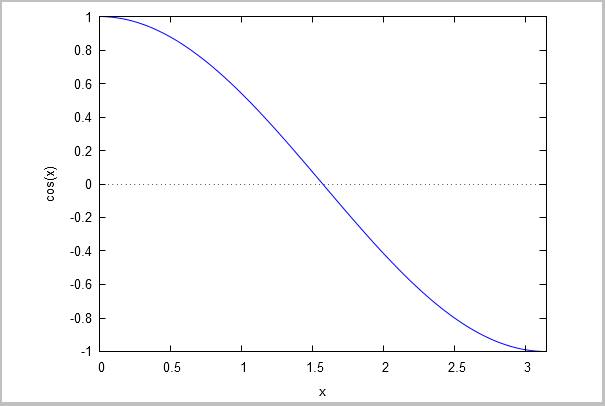

Определим функцию и проинтегрируем её:
```
	(%i33)   f(x) := x^2 + a$
	         f(5);
	         f(5), a = -5;
	         integrate( f(x), x );
	(%o31)   a+25
	(%o32)   20
	(%o33)   x^3/3+a*x
```
Иногда Maxima задает вопросы. Надо ответить и нажать SHIFT-ENTER. 
Можно сокращенно (вместо "positive;", можно "p").

Можно "ответить" заранее (функция "assume") и отменить предположение
функция "forget").

### Решение уравнений

Решение квадратного уравнения:

	solve(a*x^2 + b*x + c = 0, x);

### Линейная алгебра

Функция "matrix" создает матрицы. Матрицы могут содержать нечисловые выражения.

Функция "invert" вычисляет обратную матрицу

Функция "." вычисляет матричное произведение
```
	A: matrix([1,-1],
          	  [1,sin(c)]);
	B: invert(A);

	A.B;
	ratsimp(A.B);
```
Функция "ratsimp" использована для упрощения результата произведения "A.B".

Maxima имеет много функций упрощения выражений, зависящих от их типа.

### Графика

Графика, 2D и 3D рисунки:
```
	wxplot2d([sin(x), cos(x)], [x,0, 2*%pi]);
```
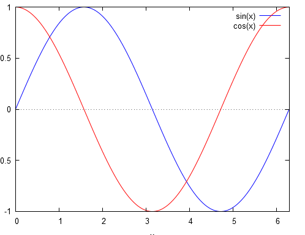

```
	wxplot2d([%e^x,160-%e^x],[x,0,5]);
```
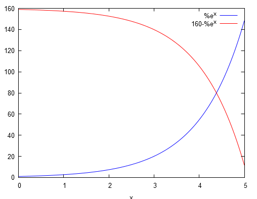
```
	wxplot3d( exp(-x^2 - y^2), [x,-2,2],[y,-2,2]);
```
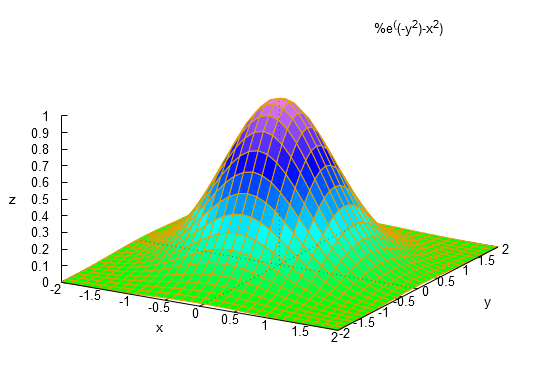

# Matlab
Matlab, или mathematical laboratory - это язык
высокого уровня и среда программирования, созданная
в 1984 году с целью удобной реализации математических
расчётов. Основная особенность - работа с данными как
с матрицами. Иными словами, он воспринимает и обрабатывает
любые данные как матрицы и осуществляет над ними действия
по правилам линейной алгебры. Пакет программ,
обеспечивающих его работу, позволяет реализовывать 
встроенные математические функции, а также работать
с комплексными переменными.

# GNU Octave

Одной из бесплатных версий, поддерживающих Matlab,
является программа **GNU Octave**. По умолчанию работа
осуществляется в командной строке, но имеется и 
пользовательский интерфейс, где есть различные меню,
справки, а также история команд.

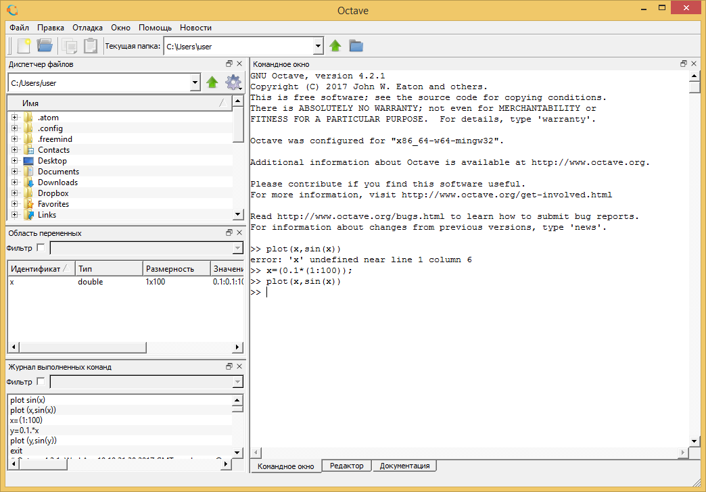

**Примеры**:

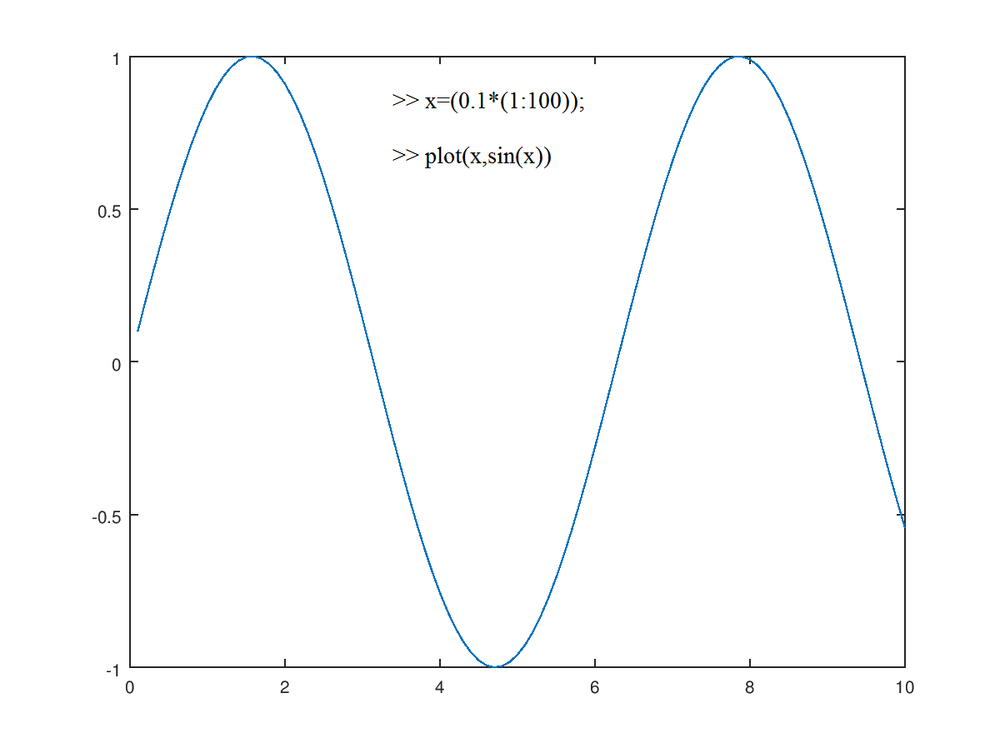

Мы можем загрузить текстовый документ с исключительно
численными данными, присвоить его некоторой переменной
и работать с ней.
```
a=load ('m3.txt');
% Так мы присваиваем второй столбец другой переменной
% (в нашем случае - это синусоидальные колебания напряжения):
b=a(:,2);
```
Также внутри программы есть основные встроенные математические
функции и операторы для необходимых преобразований.
Например, быстрое преобразование Фурье обозначается функцией fft:

```
c=fft(b);
% Так как с - комплексное число, то с помощью функции abs
% находим сразу её модуль:
plot(abs(c))
```

.png)

Чтобы построить несколько графиков в одном окне, пишем команду subplot,
в скобках через запятую указываем число строк, столбцов и текущее расположение.

```
subplot (2,1,1)
```

Так как за b у нас обозначены колебания напряжений, а нам известно, 
что частота колебаний равна 500 кГц, то по оси х отложим время, соответствующее
этим колебаниям, то есть

```
x=((1:150000)/500000);
% и строим b(x):
plot(x,b)
```

.png)

Затем переходим на место расположения другого графика:

```
subplot (2,1,2)
```

Теперь строим зависимость модуля БПФ от частоты, для чего создаём переменную y:

```
y=(1:150000)*(50/15);

plot (y,abs(c))
```

.png)

### Запись пользовательских функций
В Matlab имеется возможность не только использовать
встроенные функции, но и создавать свои. Например, ганнирование:
```
function y=hann(x)
n=size(x,2);
% Матрица, где в каждом столбце - 
% тройка последовательно расположенных значений
y=[x(1:n-2);x(2:n-1);x(3:n)];
% по правилам линейной алгебры, согласно понятию
% ганнирования, весовые коэффициенты умножаем на
% соотвествующие члены и суммируем результат
y=[0.25 0.5 0.25]*y;
y=[x(1),y,x(n)];
```
Пример медианы по тройкам:
```
function y = med3(x)
n=size(x,2);
y=[x(1:n-2);x(2:n-1);x(3:n)]
y=sum(y)-min(y)-max(y);
y=[x(1),y,x(n)];
```
# Pandoc

**Pandoc** — универсальная утилита («*швейцарский нож*») для работы с текстовыми форматами. Основная сфера применения — форматирование математических и технических текстов.

**Входные форматы:** markdown, reStructuredText, HTML, LaTeX, OPML, Org-mode, DocBook, и Office Open XML (Microsoft Word .docx)

**Выходные форматы:**

+ Форматы на основе HTML: XHTML, HTML5, HTML-слайды презентаций 
+ Форматы текстовых процессоров
+ Электронные книги
+ Форматы технической документации
+ Форматы системы *TeX*
+ PDF
+ Легковесные текстовые форматы: Markdown, reStructuredText, AsciiDoc, MediaWiki, Emacs Org-Mode, Textile

В отличие от большинства инструментов для конвертирования разметки, которые используют регулярные выражения для замены, Pandoc имеет модульную конструкцию. Программа состоит из множества отдельных модулей, которые делают разбор текста в собственное представление документа, из которого потом разметка и преобразуется в целевой формат.

Главный недостаток программы в отсутствии руководства (man) на русском языке. Pandoc имеет множество отдельных опций для разных форматов разметки, рассмотреть которые в отдельной статье затруднительно. Надеюсь, эта статья послужит для кого-нибудь стимулом создания для Pandoc русской справки man.

**Основные команды**

**Pandoc** - программа консольная, и ей требуется передавать в качестве параметров имя входного файла, а и при помощи опции "*-о*" - целевого файла. Программа может понимать входной и выходной формат разметки по расширению файла.

		pandoc input.md -o output.html

Однако можно указать входной и выходной форматы при помощи специальных опций. Выходной формат задаётся опциями "-t" или "--to", а входной - опциями "-f" или "--from". Например, следующая команда перекодирует файл input.md с разметкой Markdown в файл output.txt с html-разметкой

		pandoc input.md -o output.txt -t html

Pandoc может конвертировать форматированные тексты в файл формата pdf. Но для этого программа использует внешние приложения для получения PDF. Например, для Windows можно использовать TeX-движок MiKTeX, а для Mac OS X - BasicTeX. Для создания файла PDF просто укажите выходной файл с pdf расширением. Pandoc создаст файл LaTeX и использует pdflatex установленного PDF-движка.

		pandoc input.txt -o output.pdf

**Шаблоны**

Pandoc имеет развитую систему шаблонов. Это такие куски кода-разметки, которые программа будет добавлять в начале и конце документа дополнительно к конвертируемому тексту. Например, шаблон для HTML-файла включает теги DOCTYPE, HEAD, начальный и конечный тег BODY и HTML.
Чтобы включить шаблон в конвертируемый файл, нужно использовать опцию "-s". Другими словами при помощи этой опции создаётся полноценный формат со всеми дополнительными тегами разметки.

		pandoc input.txt -s -o output.html

Поглядеть код вставляемого по умолчанию шаблона можно командой

		pandoc -D FORMAT

**Математика**

Интересной особенностью Pandoc является поддержка конвертирования математических формул из разметки LaTeX в представление HTML. Для вывода математики в HTML используются на выбор несколько специальных математических движков на основе MathML, Java-Script, онлайн-сервисов, код которых будет вставлен в сконвертированный HTML-файл.

Для конвертирования математических формул можно использовать следующие опции:

+ --mathml - преобразует формулы LaTeX в разметку MathML;
+ --webtex - преобразует формулы LaTeX при помощи онлайн-сервиса Google Chart API;
+ --mathjax - преобразует формулы LaTeX при помощи расширения MathJax для MediaWiki;
+ --latexmathml - преобразует формулы LaTeX при помощи JS-библиотеки Latexmathml.


# SciDAVis

**SciDAVis** представляет собой интерактивное приложение, направленное на анализ научных данных и их визуализацию/публикацию. **SciDAVis** - многоплатформенное - Windows, Linux, MacOS X - свободное программное обеспечение. Данное программное обеспечение совмещает в себе широкую функциональность и интуитивно-понятный интерфейс. **SciDAVis** позволяет анализировать, обрабатывать и визуализировать экспериментальные данные и аппроксимировать кривые. Поддерживает большое количество аппроксимирующих функций, скрипты, базовые статистики с графиками и визуализацией и многое другое. 

Основные особенности программы SciDAVis: 

+ Генерирование таблиц, матриц, графиков и заметок, собираемых в проекте с удобной организацией. 
+ Таблицы для ввода данных напрямую или импорта из ASCII-файлов. 
+ Встроенные операции по анализу статистики. 
+ Различные форматы публикаций в двухмерном и трехмерном пространствах (включая EPS и PDF). У SciDAVis еще есть функции для расчета корреляции, автокорреляции, свертки и деконволюции. 
+ Функции взятия прямого и обратного быстрого преобразования Фурье (БПФ, оно же FFT) и функции для работы со спектрами и сигналами. 


Список встроенных стандартных функций для создания формул:

**Стандартные функции:**

abs, acos, acosh, asin, asinh, atan, atanh, avg
bessel_i0, bessel_i1, bessel_in, bessel_in_zero, bessel_y0, bessel_y1, bessel_yn, beta
ceil, cos, cosh, erf, erfc, erfz, erfq, exp, floor, gamma, gammaln
hazard, if, ln, log, log10, log2, min, max, mod, pow, rint, sign
sin, sinh, sqrt, sum, tan, tanh, w0, wm1 

Пример в ScoDaVis: 

+ Импортируем файл в .csv-формат черех APL.
+ Открываем программу, файл - импорт ASCII, 
+ Выбираем файл kp.csv
+ В качестве разделителя указываем запятую
+ нажимаем Open 
+ выделяем столбцы, график - точки

Строим график:


