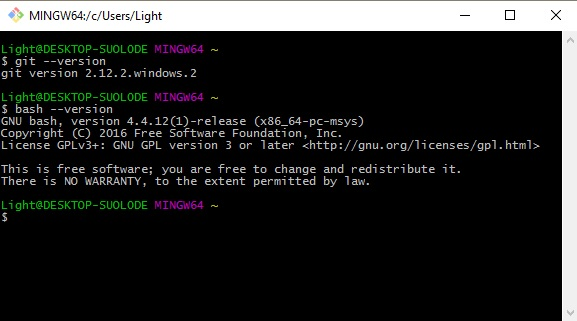

### GitHub

На сегодняшний день **GitHub** – это один из самых популярных сервисов для совместной разработки программного обеспечения и его хостинга в облаке. Крупные IT-компании, такие как Microsoft, Google, Facebook и многие другие, используют данный ресурс для размещения исходных кодов своих разработок. 

**GitHub** – это сервис на основе Git. Является удобным и популярным инструментом управления версиями и включает систему отслеживания ошибок. Адрес в Интернете: *https://github.com/*

**Репозиторий** – это хранилище исходного кода нашего программного проекта. Публичный репозиторий виден абсолютно всем, а приватный только вашим разработчикам (тем, кому мы даем доступ).
Работа с репозиторием возможна, как и с помощью **веб-сайта**, так и с помощью **клиентов для компьютера** (консольного или с графическим интерфейсом), которых существует множество.

Программа **Git Bash** - это шелл, сделанный на основе Cygwin, поэтому возможно использование Unix-команд, вроде ls, cd, mkdir.

### Настройка Git

Перед началом работы нам необходимо немного настроить программу. Нам нужно установить имя пользователя и электронный адрес через командную строку:

		git config --global user.name "имя"
		git config --global user.email "емайл"

Также нам нужно настроить параметры установок окончания строк, для Windows вводим команды: 

		git config --global core.autocrlf true
		git config --global core.safecrlf false
		git config --global core eol native

### Создание проекта

1. Создаем репозиторий на сайте github.com
2. Инициализируем папку для Git репозитория (нужно делать 1 раз для каждого проекта)

		git init

3. Связываем папку с удаленным репозиторием:

			git remote add origin https://github.com/special4KT/LecturesKT
4. Добавляем все новые и измененные файлы:

		git add

5. Помечаем все новые и измененные файлы сообщением (**commit**)

		git commit -m "message"

6. Заливаем код на удаленный репозиторий

		git push -u origin master

Данная команда используется только один раз, последующее добавление кода осуществляется без флагов

		git push

7. Для скачивания репозитория используем команду:

		git pull
8. Чтобы посмотреть статус изменений, используем команду:

		git status

### Откат изменений

1. Полный откад до предыдущего коммита

		git reset HEAD --hard

2. Сброс изменений в файле на версию коммита

		git checkout <filename>

3. Откат до установленного тега, например v1

		git checkout v1
