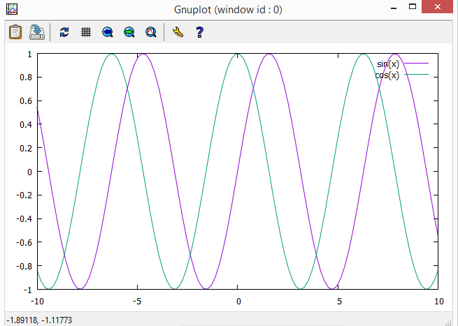
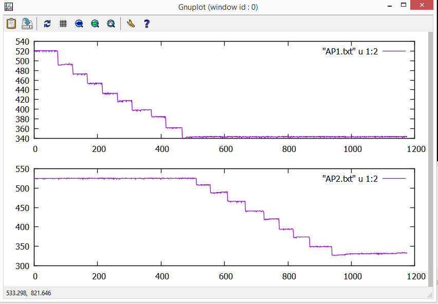

#Gnuplot
**Gnuplot** - это программа для построения двух- и трехмерных графиков. Она имеет собственную систему команд и может работать в режиме командной строки. 

Особенность этой программы в том, что она не обременена графическим интерфейсом.
##Окно программы 

/ 

##Построение графиков функций
Построим график синуса:

**gnuplot> plot sin(x)**

/

Также мы можем построить сразу несколько графиков:

**gnuplot> plot sin(x),cos(x)**

/

В программе gnuplot можно строить и 3d графиков функций или даже 4-х мерный график функций.

**Скрипты** - набор команд в текстовом файле, которые мы будем часто использовать.

Чтобы построить много графиков, воспользуемся командой **multiplot**:

**gnuplot> set multiplot**

**multiplot> set size 1,0.5**

**multiplot> set origin 0.0,0.5; plot sin(x)**

**multiplot> set origin 0.0,0.0; plot cos(x)**

**multiplot> unset multiplot**

##Получение помощи

Используя команду **help**, мы можем воспользоваться помощью

**gnuplot> help**

##Построение графиков по данным

Строим график по данным, которые находятся в текстовом документе "data.txt"

**gnuplot> cd 'C:\Users\1\Desktop'**

**gnuplot> plot "data.txt" using 1:2**

У нас получаться точки. Чтобы построить линии, нужно записать так:

**gnuplot> plot "data.txt" using 1:2 with lines**

Также в этой программе с помощью специальных команд мы можем подписывать координатные оси и названия графиков.

**set title** - главное названия (название графика);

**set xlabel** - название оси х;

**set ylabel** - название оси у;

**set xr,yr** - координаты х и у.

#Лабораторная работа

Нужно построить графики в **gnuplote** по данным W, AP, КП.

1. Строим график мощности W.

Сначала из АПЛ возьмем значения мощности и перенесем их в текстовый документ с названием "w.txt". Затем в **gnuplot** пишем команду:

**gnuplot> plot "w.txt" using 1:2 with lines**

/

2. Строим график данных двух АР.

Точно также сохраняем данные в текстовом документе и пишем в **gnuplot**:

**gnuplot> set multiplot**

**multiplot> set size 1,0.5**

**multiplot> set origin 0.0,0.5; plot "АР1.txt" using 1:2 with lines**

**multiplot> set origin 0.0,0.0; plot "АР2.txt" using 1:2 with lines**

**multiplot> unset multiplot**

/