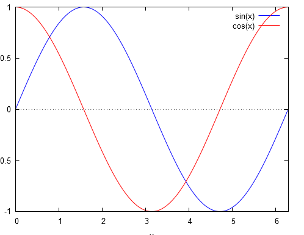
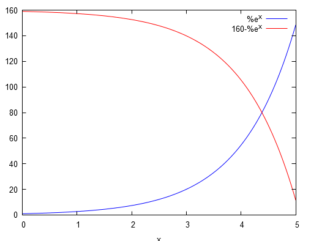

# Maxima

**Maxima** -программа для выполнения различных математических операций, также строит графики с помощью прораммы gnuplot. Ее базовый интерфейс - это командная строка. 

**wxMaxima** - пользовательский интерфейс основной программы maxima (имеются встроенные меню для выполнения стандартных математических операций).

## Символьные вычисления в Maxima

### Среда maxima и wxmaxima. Режим калькулятора

Набрать выражение, закончить строку ";" и SHIFT-ENTER для выполнения.

**(%i1)** - метка для первой строки ввода;

**(%o1)** - метка для первой строки вывода (результат вычислений).

Например: 
```
	(%i1)   2*2^-2;
	(%o1)   1/2

	(%i1)   1/2+1/4;
	(%o1)   3/4
```
**float(%);** - эта команда, выведет строку, которую мы укажем (float(%i1);).

Мы послали 5 строк (синие) на выполнение в Maxima. Каждая строка 
должна завершаться символом ";" или "$". Для ";", Maxima
выведет (покажет) результат выполнения строки. При использовании "$"
результат будет получен, но не выведен. (Полезно для скрытия промежуточных результатов громоздких вычислений).

**"1/3"** - вычисляется символьно (простая дробь);

**"1.0/3.0"** - вычисляется численно (десятичная дробь);

**%**    - использует последний результат вычислений;

**%o1**  - результат выведенный в строке с данным идентификатором.

Пример символьного вычисления с последующим переводом в численный результат:
```
	(%i10)   sqrt(2 * %pi);
             float(%);
	(%o9)    sqrt(2)*sqrt(%pi)
	(%o10)   2.506628274631001
```
### Присвоение. Алгебраические выражения

Присвоение (":") переменных:
```
(%pi - пример константы)

	(%i14)   radius: 10 $
         	 height: 100 $
         	 area: %pi * radius^2;
         	 volume: area * height;
	(area)   100*%pi
	(volume) 10000*%pi
```
Перевод результата в численную форму:
```
	(%i15)   float(%);
	(%o15)   31415.92653589793
```
Работа с алгебраическими выражениями:
```
	(%i16)   factor(y^2-x^2);
	(%o16)   (y-x)*(y+x)
	(%i17)   expand(%);
	(%o17)   y^2-x^2
	(%i18)   factor(x^2+2*x+1);
	(%o18)   (x+1)^2
	(%i19)   expand((x-1)^3);
	(%o19)   x^3-3*x^2+3*x-1
```
### Дифференцирование и интегрирование

Для дифференцирования используется функция "diff".
```
	(%i24)   f(x) := x^2 $
			 diff(f(x), x);
	         g(y) := sin(y)$
	         g(f(x));
	         diff( g(f(x)) , x);
	(%o21)   2*x
	(%o23)   sin(x^2)
	(%o24)   2*x*cos(x^2)
```
Неопределенные и определенные интегралы:
```
	(%i26)   integrate( sin(x), x);
	         integrate( sin(x), x, 0, %pi);
	(%o25)   -cos(x)
	(%o26)   2
```
Посмотрим на графике:
```
(%i27)   wxplot2d(cos(x),[x,0,%pi]);
```


Определим функцию и проинтегрируем её:
```
	(%i33)   f(x) := x^2 + a$
	         f(5);
	         f(5), a = -5;
	         integrate( f(x), x );
	(%o31)   a+25
	(%o32)   20
	(%o33)   x^3/3+a*x
```
Иногда Maxima задает вопросы. Надо ответить и нажать SHIFT-ENTER. 
Можно сокращенно (вместо "positive;", можно "p").

Можно "ответить" заранее (функция "assume") и отменить предположение
функция "forget").

### Решение уравнений

Решение квадратного уравнения:

	solve(a*x^2 + b*x + c = 0, x);

### Линейная алгебра

Функция "matrix" создает матрицы. Матрицы могут содержать нечисловые выражения.

Функция "invert" вычисляет обратную матрицу

Функция "." вычисляет матричное произведение
```
	A: matrix([1,-1],
          	  [1,sin(c)]);
	B: invert(A);

	A.B;
	ratsimp(A.B);
```
Функция "ratsimp" использована для упрощения результата произведения "A.B".

Maxima имеет много функций упрощения выражений, зависящих от их типа.

### Графика

Графика, 2D и 3D рисунки:
```
	wxplot2d([sin(x), cos(x)], [x,0, 2*%pi]);
```


```
	wxplot2d([%e^x,160-%e^x],[x,0,5]);
```

```
	wxplot3d( exp(-x^2 - y^2), [x,-2,2],[y,-2,2]);
```
